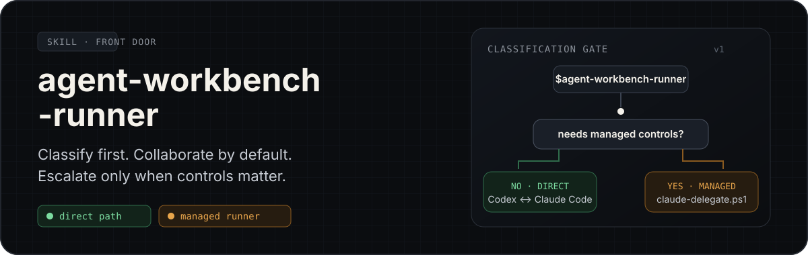
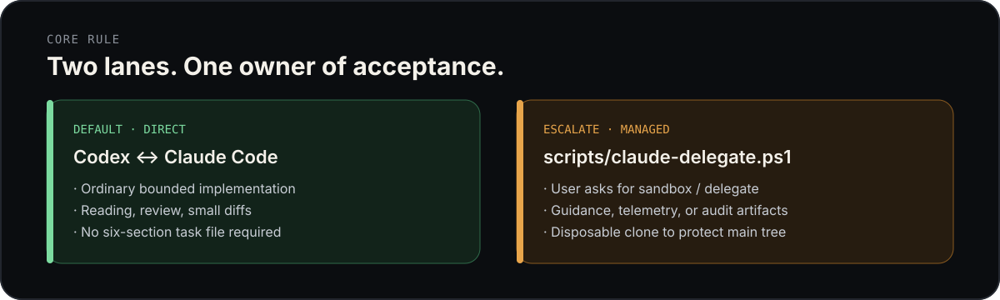
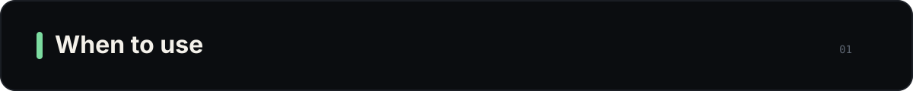
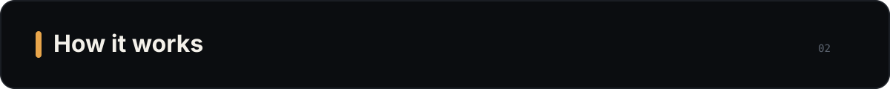
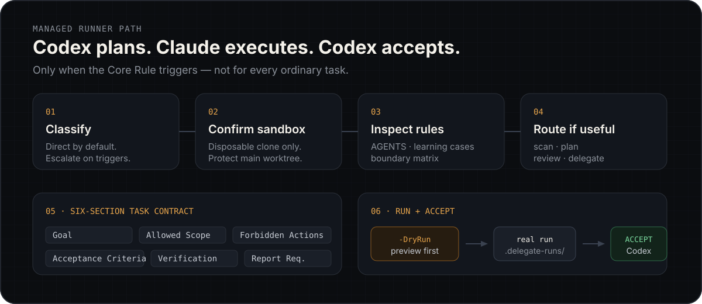
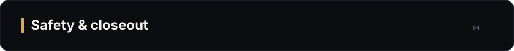

<div align="center">

# agent-workbench-runner

**Portable front door for agent-workbench: initialize a workspace, then classify — direct by default, managed runner only when controls matter.**

> Bundled scripts · two-level workspace · first-time setup · Codex plans & accepts · Claude Code executes

[中文文档](README.md) · [Quick Start](#quick-start) · [Initialization](#initialization) · [When to Use Managed](#when-to-use-the-managed-runner) · [How It Works](#how-it-works) · [Commands](#commands) · [Limits](#limits)

</div>

---

<p align="center">
  
</p>

**Invoking `$agent-workbench-runner` starts classification — not a mandatory delegate run.**  
**On first use without a workspace config, setup is blocking (no author-machine `F:\` paths required).**

| Lane | When | What happens |
| --- | --- | --- |
| **Direct** (default) | Ordinary bounded work | Codex collaborates with Claude Code; no six-section task file |
| **Managed runner** | High-risk / audit / sandbox | Runs **bundled** `scripts/claude-delegate.ps1` with a full task contract and inspectable artifacts |

The planner owns planning and **final acceptance**. Claude Code never gets final acceptance authority.

---

<p align="center">
  
</p>

## What it is

A publishable skill shaped like Baoyu-style skills: `{baseDir}/scripts` for execution + first-time setup for local config.

| Layer | Location | Contents |
| --- | --- | --- |
| **Skill package** (logic) | install dir `{baseDir}` | `SKILL.md`, `scripts/*.ps1`, contract `docs/`, templates, README |
| **Runtime workspace** (mutable) | project `.agent-workbench/` or `~/.agent-workbench/` | `config.json`, task file, sandbox, `.delegate-runs/` |

Scripts **always** run from the skill package — not from a forked copy inside the workspace.

---

## Quick Start

### Install / download

```bash
# Option A: skills.sh (after publish to Reese0302/skills)
npx skills@latest add Reese0302/skills --skill agent-workbench-runner
```

```bash
# Option B: clone monorepo and copy only this skill (copy, never move)
git clone https://github.com/Reese0302/skills.git /tmp/skills
mkdir -p ~/.claude/skills
cp -r /tmp/skills/agent-workbench-runner ~/.claude/skills/agent-workbench-runner
mkdir -p ~/.codex/skills
cp -r /tmp/skills/agent-workbench-runner ~/.codex/skills/agent-workbench-runner
```

```powershell
# Option C: local folder → skills dirs (author machine)
Copy-Item -Recurse -Force F:\agent-workbench-runner "$env:USERPROFILE\.claude\skills\agent-workbench-runner"
Copy-Item -Recurse -Force F:\agent-workbench-runner "$env:USERPROFILE\.codex\skills\agent-workbench-runner"
```

**Runtime needs:** PowerShell (5.1/7) on Windows for managed scripts, and a discoverable **Claude Code CLI**. Auto-discovery is built in; set `claude_path` in `config.json` to override.

### Trigger

```text
$agent-workbench-runner
run this with the agent workbench
initialize workbench
re-initialize workbench
```

### Mental model

```text
invoke skill
  → find workspace config (project → user)
      missing → first-time-setup (blocking) → write config + dirs
  → classify
      ├─ ordinary bounded → direct Codex ↔ Claude Code → accept
      └─ Core Rule → sandbox + six-section task + DryRun → real run → planner accepts
```

---

## Initialization

Baoyu-style Step 0: **no config → do not proceed.**

Lookup order:

1. `$PWD/.agent-workbench/config.json`
2. `~/.agent-workbench/config.json` (Windows: `%USERPROFILE%\.agent-workbench\`)

First run asks:

1. Workspace level: user home (recommended) / current project  
2. Sandbox: default `{workspace}/sandbox/` / custom disposable absolute path  
3. Language: `zh` / `en` (optional)

Then **copies templates from the skill package** (never moves existing repos):

```text
{workspace}/
├── config.json
├── AGENTS.md
├── docs/task.md
├── sandbox/           # default
└── .delegate-runs/
```

See [references/setup/first-time-setup.md](references/setup/first-time-setup.md).

Example `config.json`:

```json
{
  "schema_version": 1,
  "workspace_root": "C:\\Users\\you\\.agent-workbench",
  "sandbox_path": "./sandbox",
  "permission_profile_default": "default",
  "claude_path": null,
  "language": "en"
}
```

---

<p align="center">
  
</p>

## When to use the managed runner

Use the managed path **only** when at least one holds:

1. User explicitly requests a managed sandbox or delegate run  
2. Root guidance validation, conflict blocking, or confirmed-experience projection is required  
3. Completion needs native-web telemetry or inspectable run artifacts  
4. Work must run in a disposable sandbox to protect the main worktree  

Do not use the runner merely to polish ordinary Claude Code output.

---

<p align="center">
  
</p>

## How it works

<p align="center">
  
</p>

### Managed path

1. Ensure workspace is initialized  
2. Classify; continue only on Core Rule  
3. Use resolved `sandbox_abs`  
4. Read contract docs under `{baseDir}/docs/` and workspace `AGENTS.md`  
5. Optionally `codex-route.ps1`  
6. Fill six-section task (often `{workspace}/docs/task.md`)  
7. Prefer `-DryRun` after changes  
8. Planner inspects artifacts and accepts  

### Claim review fields

`claim` · `evidence tier` · `trust boundary` · `missing evidence` · `conclusion consistency`  

A complete artifact is not final claim acceptance.

---

<p align="center">
  
</p>

## Commands

Substitute resolved absolute paths for `{baseDir}`, `{workspace_root}`, and `{sandbox_abs}`.

```powershell
& "{baseDir}\scripts\codex-route.ps1" -TaskText "<task>"

& "{baseDir}\scripts\claude-delegate.ps1" `
  -TaskFile "{workspace_root}\docs\task.md" `
  -AddDir "{sandbox_abs}" `
  -Name <name> `
  -DryRun

& "{baseDir}\scripts\claude-delegate.ps1" `
  -TaskFile "{workspace_root}\docs\task.md" `
  -AddDir "{sandbox_abs}" `
  -Name <name>

& "{baseDir}\scripts\list-delegate-runs.ps1" -Latest 10
```

---

<p align="center">
  
</p>

## Safety & closeout

- Keep artifacts under the workspace/sandbox `.delegate-runs/` layout  
- Honor `PermissionProfile` enforcement only as documented in `docs/execution-boundary-matrix.md`  
- `WorkflowLearningCase` does not change Claude arguments by itself  
- Stop and ask before touching the main project worktree  
- **Never** treat author-only paths as defaults for other machines  

Closeout: workspace/sandbox paths · command · artifact path · verification · main tree untouched  

---

## Package layout

```text
agent-workbench-runner/
├── SKILL.md
├── README.md / README-en.md
├── assets/readme/
├── scripts/                 # copied executors (not moved from upstream)
│   ├── claude-delegate.ps1
│   ├── claude-cli-discovery.ps1
│   ├── codex-route.ps1
│   └── list-delegate-runs.ps1
├── docs/                    # read-only contracts
├── templates/workspace/     # init materials
└── references/setup/
    └── first-time-setup.md
```

---

## Limits

| Dimension | Can | Cannot |
| --- | --- | --- |
| Install | Copy/publish the skill on any machine | Ship the author's historical `F:\agent-workbench` runs |
| Execute | Bundled scripts + user workspace | Managed runs without PowerShell / Claude CLI |
| v1 scope | Classification + delegate trio + init | Entire evidence/rescue orchestrator suite |
| Acceptance | Planner final acceptance | Treat a complete artifact as automatic claim pass |

> Install skill → init workspace → stay direct when you can, escalate when controls matter. Trust remains the planner's / your call.
